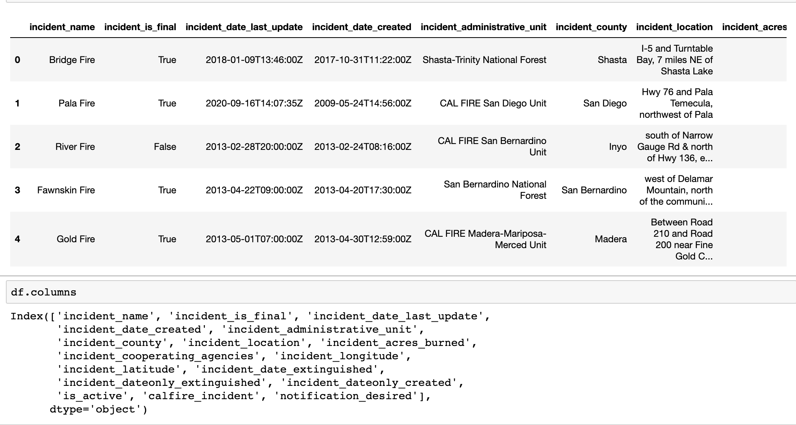
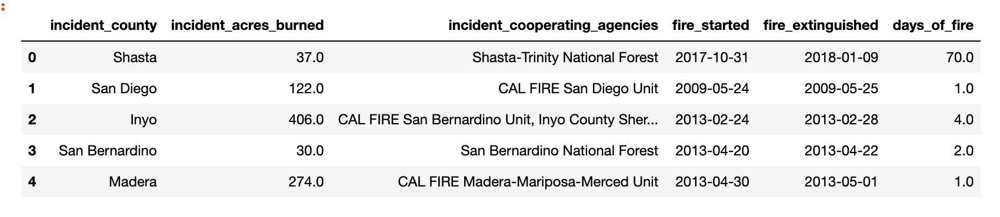
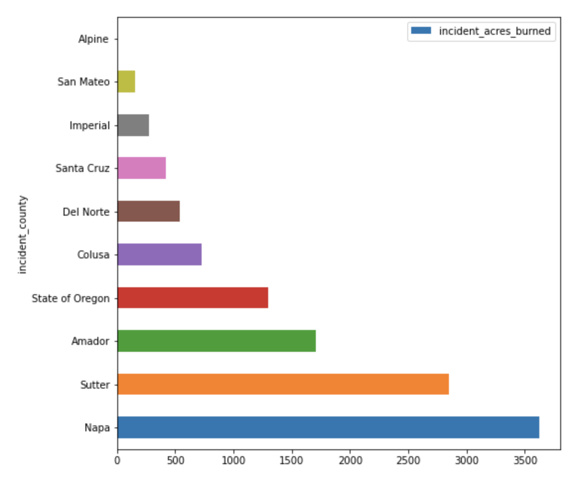
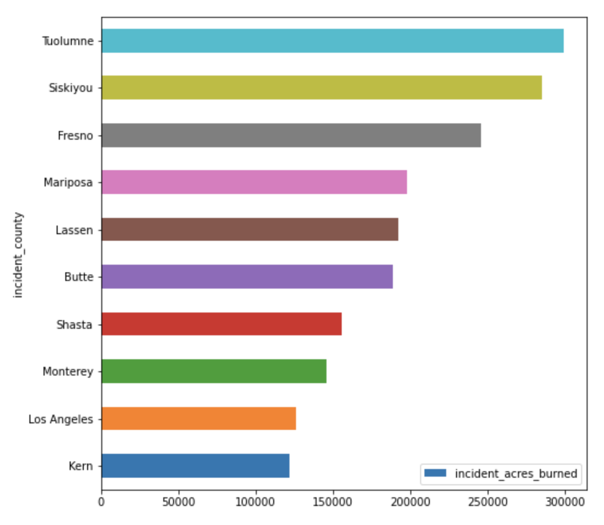
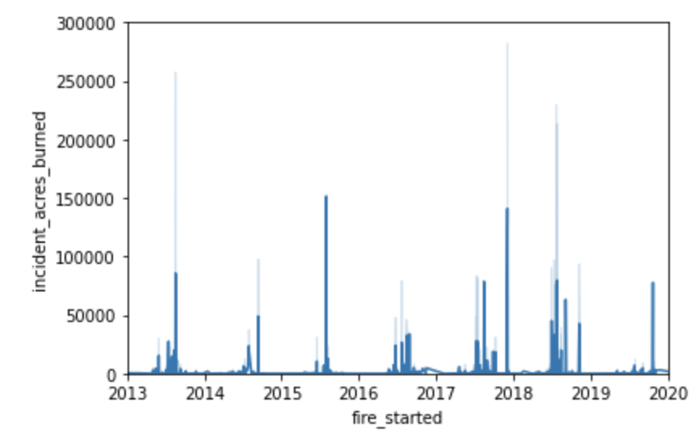
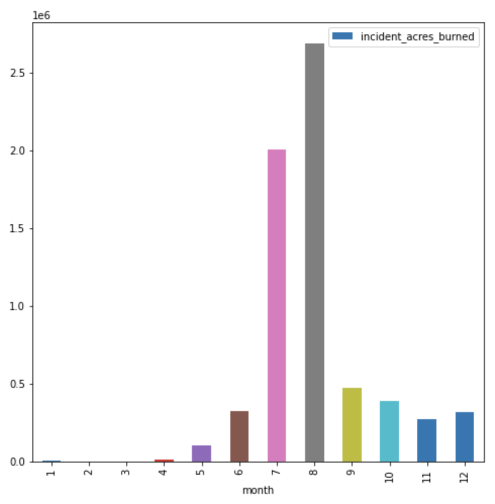

# California-fire-incidents-
Personal Project for Data Science
California has one of the most outstanding wild fires across United States so we will be diving in depth to find out which particular counties contribute the most incidents of wildfire and when exactly do wildfires occur. The data was sourced from a creditable source at data.ca.gov. The website has all sorts of information/data about California. Our findings will mostly be based on is most and least fire acres burned for each county and most when do the wild fires occur.

## Selection of Data
The model processing and training are conducted using a Jupyter Notebook and is available here.

The data has over 1,400 samples with 17 coumns: 
       [‘incident_name', 'incident_is_final', 'incident_date_last_update',
       'incident_date_created', 'incident_administrative_unit',
       'incident_county', 'incident_location', 'incident_acres_burned',
       'incident_cooperating_agencies', 'incident_longitude',
       'incident_latitude', 'incident_date_extinguished',
       'incident_dateonly_extinguished', 'incident_dateonly_created',
       'is_active', 'calfire_incident', 'notification_desired']

The objective is to predict hospital charges. The dataset can found online at git[4]. Many example solutions and analysis can be found at data.ca.gov. 

With further cleaning and removing irrelevant columns this is what we get:

## Methods
Tools:
matplotlib.pyplot, pandas, seaborn, datetime, seaborn, GitHub
VS Code as IDE

## Results
Counties that least contribute to acres burned in california:

Counties that most contribute to acres burned in california:

With further analysis, yearly timeline of acres burned wasn't giving any specific information:

Analizing months instead we could conclude August contributes to most wild fires:

## Discussion
-Counties with wild fires in August could have dryer landcape than others.
-

